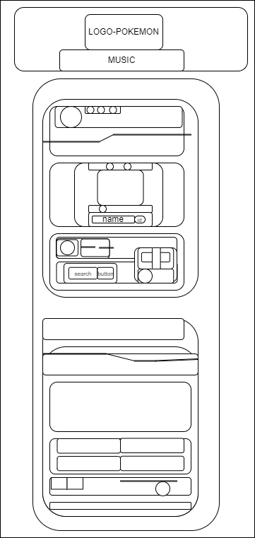
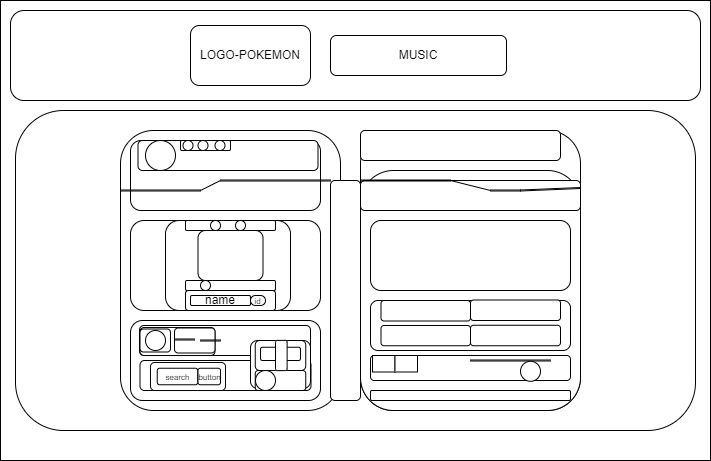

# Módulo 4: Java Script
Durante el transcuro de convertirse en un Full Stack Developer, se ha cursado por "Módulo: Diseño y Estructura de ideas", "Módulo 2: HTML", y el "Módulo 3: CSS"  y como finalización "Módulo JS" en donde al final del contenido se realiza la practica "Pokédex":
##Maquetación
###Pantallas  Smartphone (320px - 480px)

### Demas Pantallas.

#[Demostracion](./index.html)